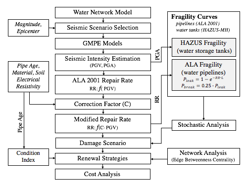

============================================
Damage and Renewal Cost Estimation Framework
============================================
The framework capable of performing seismic damage estimation and renewal analysis framework for buried water
177 distribution systems

performing transient simulation using TSNet is shown in :numref:`flowchart`

.. _flowchart:

   Flowchart of transient simulation in TSNet

The main steps of transient modelling and simulation in TSNet
are described in subsequent sections.

Damage Estimation
-----------------

, see
:class:`~tsnet.network.model.TransientModel` in the API documentation.

A transient model can be created directly from an EPANET INP file.
The following example build a transient model.

.. code:: python

    inp_file = 'examples/networks/Tnet1.inp'
    tm = tsnet.network.TransientModel(inp_file)

Cost Estimation
------------------

Cost Estimation can be performed.

**WNTRSimulators** code:

.. literalinclude:: ../examples/Tnet1_valve_closure.py
    :lines: 22-24

:math:`t_0` stands for the time when the initial condition will be
calculated. More information on the initializer can be found in
the API documentation, under
:class:`~tsnet.simulation.initialize.Initializer`.

Maintainance
---------------------------------

Maintainance Coding:

